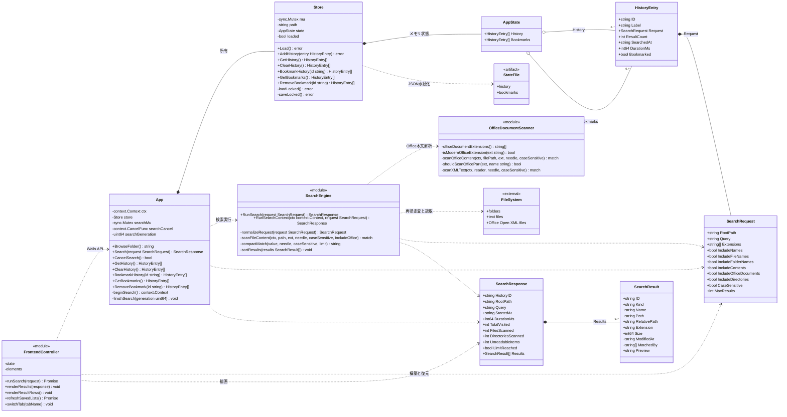

# Folder Search Lite クラス図

## 図の対象

この図は、Goバックエンドの構造体と主要モジュール、Wailsを介して接続するフロントエンド制御部を示す。

Goの検索処理とOffice文書解析は関数群で実装されている。
クラス図では、責務と依存関係を表すためにモジュールとして記載する。

## クラス図

## 関係の説明

| 起点 | 終点 | 関係 |
|---|---|---|
| `FrontendController` | `App` | `window.go.main.App`を介して公開メソッドを呼び出す。 |
| `App` | `SearchEngine` | 検索コンテキストを作り、検索結果を受け取る。 |
| `App` | `Store` | 成功した検索だけを履歴へ保存し、履歴とブックマークの操作を委譲する。 |
| `SearchEngine` | `OfficeDocumentScanner` | 対応するOffice Open XML形式の本文解析を委譲する。 |
| `Store` | `StateFile` | ユーザー設定ディレクトリのJSONファイルを一時ファイル経由で置換する。 |
| `HistoryEntry` | `SearchRequest` | 再検索できるよう、正規化済み検索条件を保持する。 |

## 多重度

`SearchResponse`は0件以上の`SearchResult`を持つ。

`AppState`は最大100件の履歴を持つ。
ブックマークには実装上の件数上限を設けていない。

`App`が保持する実行中検索は最大1件である。
新しい検索を開始すると、前の検索コンテキストをキャンセルする。
