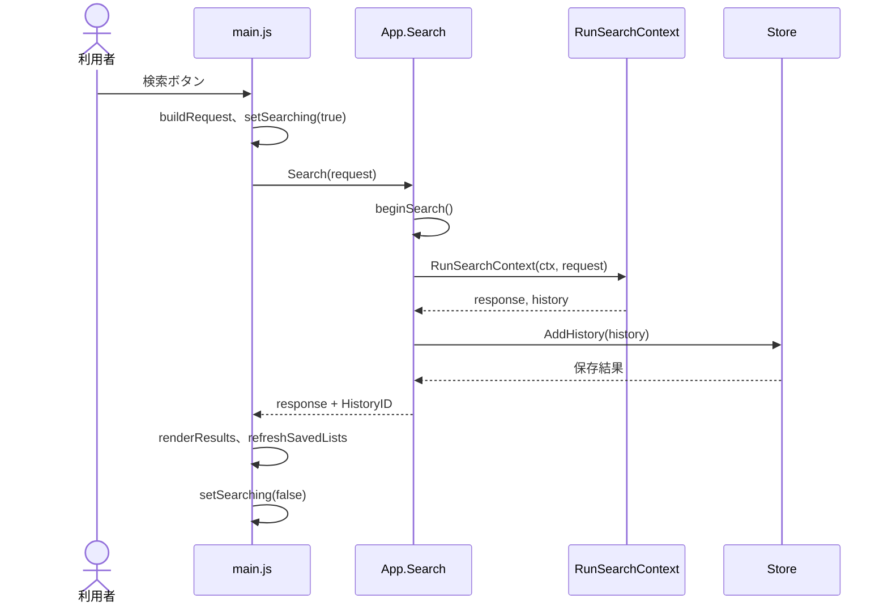
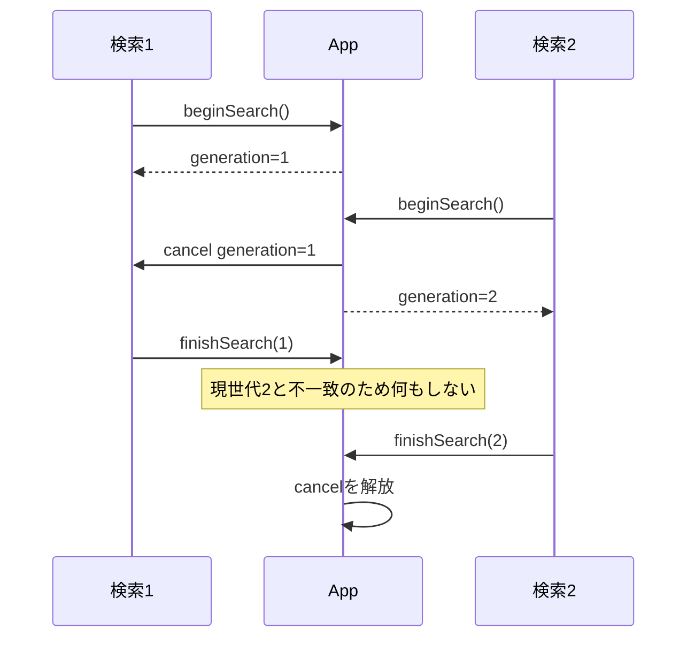

# Folder Search Lite 詳細設計書

## 文書情報

| 項目 | 内容 |
|---|---|
| システム名 | Folder Search Lite |
| 文書種別 | 詳細設計書 |
| 対象実装 | `codex/refactor-search-reliability`ブランチの現行コード |
| 関連文書 | [基本設計書](./basic-design.md)、[クラス図](./class-diagram.md) |

## ファイル構成

| ファイル | 責務 |
|---|---|
| `doc.go` | Goパッケージ全体の責務を説明する。 |
| `main.go` | 静的アセットを埋め込み、WailsウィンドウとAPIバインディングを構成する。 |
| `app.go` | Wails公開API、検索コンテキスト、検索世代を管理する。 |
| `open_windows.go` | ファイルをWindows Shell、フォルダをExplorerで開く。 |
| `open_other.go` | Windows以外の標準デスクトップオープナーで対象を開く。 |
| `search.go` | 検索要求、応答、履歴の型とファイルシステム検索を実装する。 |
| `preview.go` | プレビューの型と、プレーンテキストの一致抜粋取得を実装する。 |
| `office.go` | Office Open XML文書のZIPパーツ選択とXML本文検索を実装する。 |
| `store.go` | 履歴、ブックマーク、お気に入りフォルダーのメモリ管理とJSON永続化を実装する。 |
| `store_test.go` | お気に入りフォルダーの永続化、重複排除、入力検証、旧JSON互換性を検証する。 |
| `search_test.go` | 検索信頼性とキャンセル制御を検証する。 |
| `preview_test.go` | プレビューの大小文字条件、件数上限、Office文書取得を検証する。 |
| `open_test.go` | 開く対象の種別判定、存在確認、OS起動エラーの伝播を検証する。 |
| `frontend/dist/index.html` | タブ、検索フォーム、お気に入りフォルダー、結果グリッド、プレビューダイアログ、保存一覧のDOM構造を定義する。 |
| `frontend/dist/styles.css` | 画面配置、結果グリッド、強調色、プレビュー、レスポンシブ表示を定義する。 |
| `frontend/dist/main.js` | UI状態、Wails API呼び出し、描画、強調表示、プレビュー、フィルター、ソート、イベントを実装する。 |
| `wails.json` | Wailsプロジェクト名、アセット、出力ファイル名を定義する。 |

## 起動処理

### Wails構成

`main`は`NewApp`でアプリケーションAPIを生成し、次の設定で`wails.Run`を呼ぶ。

| 設定 | 値 | 理由 |
|---|---:|---|
| Title | Folder Search Lite | ウィンドウタイトル |
| Width | 1440 | 広い画面で検索条件を一行表示する。 |
| Height | 900 | 検索条件と結果領域を同時に表示する。 |
| MinWidth | 960 | 2列レスポンシブ配置の操作可能幅を保つ。 |
| MinHeight | 640 | 検索フォームと結果領域の最低高を保つ。 |
| Assets | `frontend/dist`の埋め込みFS | 外部WebサーバーなしでUIを配信する。 |
| OnStartup | `App.startup` | Wailsコンテキストを保存し、状態を読み込む。 |
| Bind | `App` | 公開メソッドをJavaScriptへ公開する。 |

### 初期画面処理

ブラウザーが`main.js`を読み込むと、DOM参照とイベントを登録して`refreshSavedLists`を実行する。

初期処理では検索を実行しない。
履歴、ブックマーク、お気に入りフォルダーだけをバックエンドから取得する。

## Wails公開API

### メソッド一覧

| メソッド | 入力 | 正常時の出力 | 主なエラー |
|---|---|---|---|
| `BrowseFolder` | なし | 選択パス。取消時は空文字。 | startup前の呼び出し、OSダイアログエラー |
| `Search` | `SearchRequest` | `SearchResponse` | ルート不正、キャンセル、走査失敗、履歴保存失敗 |
| `PreviewFile` | `FilePreviewRequest` | `FilePreview` | 対象または検索語の未指定、非通常ファイル、読み取り失敗 |
| `OpenResult` | 対象パス | なし | パス未指定、対象不存在、非通常ファイル、OS起動失敗 |
| `CancelSearch` | なし | キャンセル対象があれば`true` | なし |
| `GetHistory` | なし | `HistoryEntry[]` | 状態ファイル読み込み失敗 |
| `ClearHistory` | なし | 空の`HistoryEntry[]` | 状態ファイル読み書き失敗 |
| `BookmarkHistory` | 履歴ID | 更新後の`HistoryEntry[]` | 履歴ID不存在、状態ファイル読み書き失敗 |
| `GetBookmarks` | なし | `HistoryEntry[]` | 状態ファイル読み込み失敗 |
| `RemoveBookmark` | ブックマークID | 更新後の`HistoryEntry[]` | 状態ファイル読み書き失敗 |
| `AddFavoriteFolder` | フォルダーパス | 更新後の`FavoriteFolder[]` | 空パス、対象不存在、非フォルダー、状態ファイル読み書き失敗 |
| `GetFavoriteFolders` | なし | `FavoriteFolder[]` | 状態ファイル読み込み失敗 |
| `RemoveFavoriteFolder` | お気に入りID | 更新後の`FavoriteFolder[]` | 状態ファイル読み書き失敗 |

### Searchの処理順序



`RunSearchContext`または`AddHistory`が失敗した場合、`Search`は空の応答とエラーを返す。
キャンセルされた検索の途中結果は履歴へ保存しない。

### PreviewFileの処理順序

1. パスと検索語の前後空白を除去する。
2. 対象が存在する通常ファイルかを確認する。
3. Office Open XML文書は対象XMLパーツ、その他はテキスト行を読み取る。
4. 一致箇所を最大12件まで収集する。
5. 13件目を検出した場合は`truncated`を`true`とし、後続の読み取りを終了する。

検索結果応答に複数の抜粋は含めない。
利用者が「プレビュー」を押したときだけ`PreviewFile`を呼び出す。

### OpenResultの処理順序

1. パスが空でないことを確認し、絶対パスへ変換する。
2. `os.Stat`で対象が現在も存在することを確認する。
3. 通常ファイルまたはフォルダ以外の対象を拒否する。
4. Windowsでは通常ファイルをShellの関連付け先へ渡し、フォルダを`explorer.exe`へ渡す。
5. OS起動に失敗した場合はWails経由で画面へエラーを返す。

## 検索データ構造

### SearchRequest

| フィールド | JSON名 | 型 | 正規化と用途 |
|---|---|---|---|
| `RootPath` | `rootPath` | string | 前後空白を除去して`filepath.Clean`を適用する。 |
| `Query` | `query` | string | 前後空白を除去する。大小区別なしでは照合時に小文字化する。 |
| `Extensions` | `extensions` | string[] | 小文字、ピリオド付き、重複なし、辞書順へ変換する。 |
| `ExcludedFileNames` | `excludedFileNames` | string[] | 前後空白と大小文字違いの重複を除き、完全一致の除外条件として使用する。 |
| `ExcludedExtensions` | `excludedExtensions` | string[] | `Extensions`と同じ形式へ正規化し、対象拡張子より優先して除外する。 |
| `IncludeNames` | `includeNames` | bool | 旧履歴との互換フィールドとして使用する。 |
| `IncludeFileNames` | `includeFileNames` | bool | ファイル名照合を有効化する。 |
| `IncludeFolderNames` | `includeFolderNames` | bool | フォルダ名照合を有効化する。 |
| `IncludeContents` | `includeContents` | bool | 本文照合を有効化する。 |
| `IncludeOfficeDocuments` | `includeOfficeDocuments` | bool | 対応Office文書の本文照合を有効化する。 |
| `IncludeDirectories` | `includeDirectories` | bool | 旧履歴のフォルダ条件を復元する。 |
| `CaseSensitive` | `caseSensitive` | bool | 大文字と小文字の区別を指定する。 |
| `MaxResults` | `maxResults` | int | 0以下は500、5000超は5000へ補正する。 |

すべての検索対象フラグが無効で拡張子条件もない場合は、ファイル名検索を有効化する。
この補正により、条件のない要求が常に空結果になることを防ぐ。

### SearchResult

| フィールド | JSON名 | 内容 |
|---|---|---|
| `ID` | `id` | 応答内の走査順から作る`result-N`形式の一時ID |
| `Kind` | `kind` | `file`または`folder` |
| `Name` | `name` | 親パスを含まない項目名 |
| `Path` | `path` | コピー操作に使用するフルパス |
| `RelativePath` | `relativePath` | 検索ルートを基準にしたパス。計算失敗時は項目名。 |
| `Extension` | `extension` | 小文字へ変換した拡張子 |
| `Size` | `size` | ファイルのバイト数。フォルダは0。 |
| `ModifiedAt` | `modifiedAt` | RFC 3339形式の更新日時 |
| `MatchedBy` | `matchedBy` | `extension`、`file-name`、`folder-name`、`content`の配列 |
| `Preview` | `preview` | 本文一致の周辺。名前または拡張子だけの一致では空。 |

### SearchResponse

| フィールド | JSON名 | 内容 |
|---|---|---|
| `HistoryID` | `historyId` | 履歴保存成功後に設定するID |
| `RootPath` | `rootPath` | 正規化済み検索ルート |
| `Query` | `query` | 正規化済み検索語 |
| `StartedAt` | `startedAt` | RFC 3339形式の開始時刻 |
| `DurationMs` | `durationMs` | 検索処理時間 |
| `TotalVisited` | `totalVisited` | メタデータ取得に成功した項目数 |
| `FilesScanned` | `filesScanned` | 走査したファイル数 |
| `DirectoriesScanned` | `directoriesScanned` | 走査したフォルダ数 |
| `UnreadableItems` | `unreadableItems` | 個別に除外した項目数 |
| `LimitReached` | `limitReached` | 結果上限による早期終了の有無 |
| `Results` | `results` | 検索結果配列 |

### FilePreviewRequest

| フィールド | JSON名 | 内容 |
|---|---|---|
| `Path` | `path` | プレビュー対象のフルパス |
| `Query` | `query` | 内容で再照合する検索語 |
| `CaseSensitive` | `caseSensitive` | 大文字と小文字の区別 |
| `IncludeOfficeDocuments` | `includeOfficeDocuments` | Office Open XML解析の有効状態 |

### FilePreview

| フィールド | JSON名 | 内容 |
|---|---|---|
| `Name` | `name` | 親ディレクトリを含まないファイル名 |
| `Path` | `path` | 読み取り時点で正規化したフルパス |
| `Excerpts` | `excerpts` | `FilePreviewExcerpt`の配列 |
| `Truncated` | `truncated` | 上限を超える一致を省略したか |

`FilePreviewExcerpt`は、行番号またはOfficeパーツ名を示す`location`と、最大600ルーンの`text`を持つ。

### HistoryEntry

| フィールド | JSON名 | 内容 |
|---|---|---|
| `ID` | `id` | `search-`とUnixナノ秒から作るローカルID |
| `Label` | `label` | 検索語と対象拡張子に除外条件を加え、` / `で連結した表示名。対象条件なしは`all`。 |
| `Request` | `request` | 再検索用の正規化済み要求 |
| `ResultCount` | `resultCount` | 検索時の結果件数 |
| `SearchedAt` | `searchedAt` | 検索開始時刻 |
| `DurationMs` | `durationMs` | 検索処理時間 |
| `Bookmarked` | `bookmarked` | 対応ブックマークの有無 |

### FavoriteFolder

| フィールド | JSON名 | 内容 |
|---|---|---|
| `ID` | `id` | `folder-`とUnixナノ秒から作る解除用ローカルID |
| `Path` | `path` | 登録時に検証し、`filepath.Abs`と`filepath.Clean`を適用した絶対パス |

## 検索アルゴリズム

### 要求の正規化

1. 検索ルートの空白を除き、OS形式のパスへ正規化する。
2. 検索語の前後空白を除く。
3. 対象・除外拡張子を小文字かつピリオド付きへ統一し、空要素と重複を除く。
4. 除外ファイル名の前後空白と大小文字違いの重複を除く。
5. 旧互換フラグを個別のファイル名、フォルダ名フラグへ変換する。
6. 検索対象が一つもない場合はファイル名検索を有効にする。
7. 結果上限を1件から5000件の実装範囲へ補正する。

### ルートの検証

`os.Stat`で検索ルートを確認する。

パスが読めない場合は`folder path cannot be read`へ原因をラップする。
パスがディレクトリでない場合は`folder path must be a directory`を返す。

### 走査と照合

1. 明示された拡張子集合、実際に走査する対象拡張子集合、ファイル名と拡張子の除外集合を作る。
2. `filepath.WalkDir`でルート配下を逐次走査する。
3. 各コールバックの先頭でコンテキストを確認する。
4. 個別の走査エラーを`UnreadableItems`へ加算する。
5. 除外ファイル名または除外拡張子に一致するファイルを、メタデータ取得前に除外する。
6. メタデータ取得エラーを`UnreadableItems`へ加算し、取得に成功した項目の走査統計を更新する。
7. 対象拡張子集合に含まれないファイルを早期除外する。
8. 拡張子、ファイル名、フォルダ名、本文の順に一致理由を蓄積する。
9. 一致理由がない項目を除外する。
10. `SearchResult`を生成する。
11. 結果上限へ到達した場合は`filepath.SkipAll`で正常終了する。
12. 種別、相対パスの順に安定ソートする。
13. 同じ要求を保持する`HistoryEntry`を生成する。

### 名前照合

検索語が空の場合、`matchesQuery`は`true`を返す。

拡張子だけを指定した検索では、対象ファイル名を検索語なしで結果へ含められる。
明示拡張子がない検索語なしの要求では、ファイル名とフォルダ名の有効状態に従って項目を列挙する。

大小区別が無効な場合は、比較対象と検索語を小文字へ変換して`strings.Contains`で照合する。

### プレーンテキスト本文検索

1. ファイルを読み取り専用で開く。
2. 先頭8000バイトを読み、NUL文字があればバイナリとして除外する。
3. ファイル位置を先頭へ戻す。
4. 64KBの`bufio.Reader`で改行まで読み取る。
5. 各行の処理前にコンテキストを確認する。
6. 検索語を含む行を発見したら、行番号と最大220ルーンのプレビューを返す。
7. EOFまで一致しなければ正常な不一致を返す。

`ReadString`は内部バッファを超えた行も連結する。
一行の長さには実装上の上限を設けていない。

### プレビュー生成

`compactMatch`は連続空白を一つへ畳んだ後、一致箇所を中心に最大指定ルーン数を切り出す。

検索位置は`strings.Index`が返すバイト位置からルーン位置へ変換する。
切り出しが原文の途中から始まる、または途中で終わる場合は`...`を付ける。

## Office Open XML解析

### 対応形式

| 製品 | 拡張子 |
|---|---|
| Word | `.docx`, `.docm`, `.dotx`, `.dotm` |
| Excel | `.xlsx`, `.xlsm`, `.xltx`, `.xltm` |
| PowerPoint | `.pptx`, `.pptm`, `.ppsx`, `.ppsm`, `.potx`, `.potm` |

`.doc`、`.dot`、`.xls`、`.xlt`、`.ppt`、`.pps`、`.pot`はOffice拡張子一覧に含む。
ただし、ZIPとXMLで構成されないため本文解析は行わない。

### 検索対象パーツ

| 製品 | ZIP内パス |
|---|---|
| Word | `word/document.xml`、ヘッダー、フッター、コメント、脚注、文末脚注 |
| Excel | 共有文字列、ワークシート、コメント、スレッドコメント、描画 |
| PowerPoint | スライド、ノート、コメント |

### XML照合

1. OfficeファイルをZIPとして開く。
2. 対象パーツだけを開く。
3. `xml.Decoder`でトークンを逐次取得する。
4. `xml.CharData`の連続空白を畳み、空白区切りで照合バッファへ追加する。
5. 要素境界をまたぐ検索語を含め、現在のバッファ全体を照合する。
6. バッファが3000ルーンを超えた場合は後半1500ルーンだけを残す。
7. 一致時は製品名と最大220ルーンのプレビューを返す。

一つのパーツでエラーが発生しても、残りのパーツを検索する。
一致が見つかった場合は、それ以前の非致命的エラーより一致結果を優先する。
一致しなかった場合は最初の解析エラーを呼び出し元へ返す。

## 検索キャンセル設計

### 状態

`App`は`searchCancel`と`searchGeneration`を`searchMu`で保護する。

| 状態 | `searchCancel` | 意味 |
|---|---|---|
| 待機 | `nil` | 実行中検索がない。 |
| 検索中 | 関数あり | 現在の検索へキャンセルを通知できる。 |

### 世代管理



世代番号を確認しない場合、古い検索の`defer`が新しい検索のキャンセル関数を消去できてしまう。
`finishSearch`は、渡された世代が現在値と一致するときだけ状態を解放する。

## 永続化設計

### 保存先

`os.UserConfigDir`が返すディレクトリの`FolderSearchLite/state.json`へ保存する。

ユーザー設定ディレクトリの取得に失敗した場合は、カレントディレクトリを使用する。

### JSON形式

```json
{
  "history": [
    {
      "id": "search-...",
      "label": "target / .txt",
      "request": {},
      "resultCount": 10,
      "searchedAt": "2026-07-19T00:00:00+09:00",
      "durationMs": 125,
      "bookmarked": true
    }
  ],
  "bookmarks": [],
  "favoriteFolders": [
    {
      "id": "folder-...",
      "path": "C:\\Projects\\sample"
    }
  ]
}
```

`request`には`SearchRequest`の全JSONフィールドが入る。

### 読み込み

`Store`は初回操作時に遅延読み込みする。
`loaded`が`true`になった後は、同じプロセス内で状態ファイルを再読込しない。

状態ファイルが存在しない、または0バイトの場合は空状態として扱う。
JSONが不正な場合は呼び出し元へエラーを返す。
旧状態ファイルに`favoriteFolders`がない場合は、空配列として読み込む。

### 保存

1. 保存先ディレクトリを`0700`で作る。
2. 状態をインデント付きJSONへ変換する。
3. `state.json.tmp`へ`0600`で書く。
4. `os.Rename`で`state.json`を置き換える。

すべての公開操作は、読み込み、メモリ更新、保存、戻り値コピーが完了するまでミューテックスを保持する。

### 履歴

新しい履歴は配列の先頭へ追加する。
100件を超えた場合は末尾を切り捨てる。

同じIDのブックマークが存在する場合は、新しい履歴の`Bookmarked`を`true`にする。

### ブックマーク

ブックマークは履歴IDをキーとして更新する。

既存ブックマークがあれば内容を置き換える。
存在しなければ先頭へ追加する。

解除操作は冪等である。
対象IDが存在しない場合もエラーにしない。

### お気に入りフォルダー

登録時は前後空白を除き、絶対パスへ変換してから`os.Stat`で存在するフォルダーかを確認する。
通常ファイル、存在しないパス、空パスは保存しない。

新しい登録は配列の先頭へ追加する。
同じパスがすでに存在する場合はIDを維持して先頭へ移動し、重複を作らない。
Windowsでは大文字と小文字を区別せず、それ以外のOSでは区別してパスを比較する。

解除はIDで対象を特定し、存在しないIDも正常終了する。
ファイルシステム上のフォルダーや、画面の検索フォルダー入力は削除しない。

## フロントエンド状態設計

### state

| プロパティ | 型 | 内容 |
|---|---|---|
| `activeTab` | string | `search`、`history`、`bookmarks`の現在値 |
| `history` | array | バックエンドから取得した履歴 |
| `bookmarks` | array | バックエンドから取得したブックマーク |
| `favoriteFolders` | array | バックエンドから取得したお気に入りフォルダー |
| `currentHistoryId` | string | 直近検索を保存するための履歴ID |
| `searching` | boolean | 検索実行中フラグ |
| `results` | array | バックエンドから受け取った未加工の結果 |
| `query` | string | 一覧と詳細プレビューで強調する検索語 |
| `caseSensitive` | boolean | 強調時の大小文字区別 |
| `includeOfficeDocuments` | boolean | 詳細プレビューのOffice解析フラグ |
| `previewGeneration` | number | 閉じた後に到着したプレビュー応答を無効化する世代番号 |
| `filters` | object | 6列のフィルター文字列 |
| `sort.key` | string | 現在のソート列。未指定は空文字。 |
| `sort.direction` | string | `asc`または`desc` |

`results`はフィルターとソートで直接変更しない。
`getVisibleResults`が`filter`で新しい配列を作り、その配列だけをソートする。

### DOM参照

| グループ | IDまたはクラス | 用途 |
|---|---|---|
| 状態 | `#statusText` | エラー、検索中、検索結果概要を表示する。 |
| タブ | `.tab-button`, `.panel` | 選択状態と表示パネルを切り替える。 |
| 検索条件 | `#rootPath`から`#maxResults`、`#advancedSearch` | `SearchRequest`を構築し、除外条件を必要なときだけ展開する。 |
| 検索操作 | `#searchButton`, `#cancelSearchButton`, `#bookmarkCurrentButton` | 検索、中断、保存を行う。 |
| お気に入り | `#favoriteFolderSelect`, `#addFavoriteFolderButton`, `#removeFavoriteFolderButton` | 検索フォルダーの選択、登録、解除を行う。 |
| 結果統計 | `#resultSummary`, `#scanSummary` | 表示件数と走査件数を表示する。 |
| 結果 | `#resultsBody` | 動的な結果行を保持する。 |
| フィルター | `.column-filter`, `#clearFiltersButton` | 表示結果を列別に絞り込む。 |
| ソート | `.sort-button` | ソート列と方向を切り替える。 |
| プレビュー | `#previewDialog`, `#previewContent` | ファイル情報と一致抜粋を表示する。 |
| 保存一覧 | `#historyList`, `#bookmarkList` | 履歴とブックマークのカードを保持する。 |

## フロントエンド処理

### 検索要求の構築

`buildRequest`はフォーム値を読み、互換フィールドを含む要求を作る。

除外ファイル名はカンマ、セミコロンで分割し、名前内の空白を保持する。
除外拡張子は対象拡張子と同じく、カンマ、空白、セミコロンで分割する。
`applyRequest`は保存済みの除外条件を復元し、いずれかが存在する場合は詳細条件を開く。

`includeNames`はファイル名またはフォルダ名が有効な場合に`true`となる。
`includeDirectories`はフォルダ名フラグと同じ値を持つ。

### 検索中のUI制御

`setSearching(true)`は検索ボタン、参照ボタン、お気に入り操作を無効化し、中断ボタンを有効化する。

検索成功、失敗、キャンセルのいずれでも、`runSearch`の`finally`が`setSearching(false)`を呼ぶ。

### お気に入りフォルダー操作

`refreshSavedLists`は履歴、ブックマーク、お気に入りフォルダーを並行取得する。
`renderFavoriteFolders`は保存済みパスを`option.textContent`へ設定し、現在の選択IDまたは入力パスと一致する項目を復元する。

一覧の変更時は選択項目のパスを`rootPath`へ反映するが、検索は自動実行しない。
パスの手入力またはフォルダー参照時も、一致するお気に入りがあれば選択状態を同期する。

登録後はバックエンドが返した先頭項目の正規化済みパスとIDを入力・選択へ反映する。
解除後も`rootPath`は維持し、お気に入り一覧だけを再描画する。

### 一致語の強調表示

`highlightText`は検索語を正規表現としてエスケープし、大小文字条件を保ったまますべての一致位置を取得する。
各一致と非一致の文字列を個別にHTMLエスケープし、一致区間だけを`mark.search-hit`で囲む。

名前は`file-name`または`folder-name`で一致した結果だけを強調する。
内容は`content`で一致した結果の一覧抜粋と詳細プレビューを強調する。

### 詳細プレビュー

`openFilePreview`は、検索結果に含まれる最初の抜粋をすぐにダイアログへ表示する。
その後で`PreviewFile`を呼び出し、返却された抜粋一覧へ置き換える。

開いている間に別のプレビューを開くかダイアログを閉じると、`previewGeneration`を更新する。
応答時の世代が現在値と異なる場合は描画しない。

### 結果フィルター

| キー | 判定 |
|---|---|
| `kind` | `file`または`folder`の完全一致 |
| `name` | 大小区別なしの部分一致 |
| `relativePath` | 相対パスと本文プレビューを連結した文字列への部分一致 |
| `matchedBy` | 一致理由配列に選択値が含まれるか |
| `size` | 比較式または表示文字列への部分一致 |
| `modifiedAt` | 日本語表示へ変換した日時への部分一致 |

複数列のフィルターはAND条件である。

フィルターが一つでも有効な場合、件数表示を`表示件数 / 全件数`へ切り替える。

### サイズ比較式

解析パターンは次の正規表現に対応する。

```text
^(<=|>=|<|>|=)?\s*(\d+(?:\.\d+)?)\s*(b|kb|mb|gb|tb)?$
```

演算子省略時は完全一致、単位省略時はバイトとして扱う。
単位換算は1024の累乗を使用する。

### 結果ソート

同じ列見出しを押すと`asc`と`desc`を反転する。
別の列を押すと昇順から開始する。

| 列 | 比較方法 |
|---|---|
| 種別 | ファイル、フォルダの日本語表示を`Intl.Collator`で比較 |
| 名前 | 日本語ロケール、大小差を弱く扱う自然数比較 |
| 相対パス | 日本語ロケール、大小差を弱く扱う自然数比較 |
| 一致 | 一致理由の日本語表示を連結して比較 |
| サイズ | バイト数の数値比較 |
| 更新 | `Date.getTime`の数値比較。不正値は0。 |

選択中列の`th`へ`aria-sort="ascending"`または`descending`を設定する。

### 動的HTMLの安全性

ファイル名、パス、本文プレビュー、履歴ラベルは`escapeHtml`を通す。
強調表示も一致区間と非一致区間をエスケープした後で、実装側が生成する`mark`要素だけを追加する。

お気に入りフォルダーのパスはHTML文字列へ連結せず、`option.textContent`で設定する。

`data-*`属性へ入れる値は`escapeAttribute`を通し、HTML特殊文字とバッククォートを置換する。

### 動的ボタンのイベント委譲

結果行と保存カードは再描画で置き換わる。
このため、個々のボタンへイベントを登録せず、`document`のクリックイベントで次の属性を確認する。

| data属性 | 操作 |
|---|---|
| `data-open-id` | 対応する検索結果を探し、`OpenResult`へフルパスを渡す。 |
| `data-preview-id` | 対応する検索結果を探し、内容プレビューを開く。 |
| `data-copy` | フルパスをコピーする。 |
| `data-rerun` | 保存済み要求をフォームへ復元して再検索する。 |
| `data-bookmark` | 履歴をブックマークする。 |
| `data-remove-bookmark` | ブックマークを解除する。 |

## レスポンシブCSS

### 1400px超

通常の検索フォームは次の6列であり、お気に入りと詳細条件はそれぞれ下の全幅行へ配置する。

```text
フォルダ | 文字列 | 拡張子 | チェック項目 | 上限 | 操作
お気に入りフォルダー
詳細条件（除外ファイル名、除外拡張子）
```

### 1081px以上1400px以下

CSS Gridの領域名を使って次の4行へ配置する。

```text
path     | query    | extensions | max
controls | controls | actions    | actions
favorites| favorites| favorites  | favorites
advanced | advanced | advanced   | advanced
```

### 1080px以下

ヘッダーを縦積みにし、フォームを次の6行へ配置する。

```text
path     | path
query    | extensions
controls | controls
max      | actions
favorites| favorites
advanced | advanced
```

## エラー伝播

| 発生箇所 | 内部処理 | UI表示 |
|---|---|---|
| `RunSearchContext`のルート検証 | エラーを返す。 | `errorMessage`で状態欄へ表示する。 |
| `WalkDir`の個別項目 | `UnreadableItems`へ加算する。 | 検索完了時の詳細へ件数を表示する。 |
| 本文読み取り | キャンセル以外は`UnreadableItems`へ加算する。 | 検索完了時の詳細へ件数を表示する。 |
| `PreviewFile`の読み取り | エラーをWailsへ返す。 | ダイアログ内にエラーと検索時の抜粋を表示する。 |
| `OpenResult`の存在確認、OS起動 | エラーをWailsへ返す。 | 状態欄へ表示する。 |
| お気に入り登録時のパス検証 | 不正なパスを保存せず、エラーをWailsへ返す。 | 状態欄へ表示する。 |
| `context.Canceled` | `App.Search`が「検索を中断しました」へ変換する。 | 状態欄へ表示する。 |
| Store読み書き | エラーをWailsへ返す。 | 状態欄へ表示する。 |
| Wails API不存在 | `callBackend`がErrorを生成する。 | 状態欄へ表示する。 |
| クリップボード失敗 | Promiseをrejectする。 | 状態欄へ表示する。 |

## テスト詳細

| テスト | 前提 | 操作 | 期待結果 |
|---|---|---|---|
| `TestRunSearchFindsMatchAfterOneMegabyteInSingleLine` | 1MB超の単一行末尾に検索語がある。 | 本文検索を実行する。 | 1件一致し、プレビューに行番号と検索語を含む。 |
| `TestRunSearchContextStopsWhenCanceled` | 呼び出し前にコンテキストをキャンセルする。 | コンテキスト付き検索を実行する。 | `context.Canceled`を返す。 |
| `TestRunSearchCountsUnreadableOfficeDocument` | ZIPではない`.docx`を置く。 | Office本文検索を実行する。 | 検索は成功し、失敗件数が1、結果が0件になる。 |
| `TestAppCancelSearchCancelsActiveContext` | 実行中コンテキストを作る。 | `CancelSearch`を二度呼ぶ。 | 一度目はtrueでコンテキスト停止、二度目はfalseになる。 |
| `TestFinishingOlderSearchDoesNotCancelNewSearch` | 二世代の検索を開始する。 | 古い世代の終了処理を呼ぶ。 | 新しい検索は有効なままになる。 |
| `TestLoadFilePreviewReturnsMatchingLines` | 大小文字が異なる一致行がある。 | 大小文字を区別せずプレビューする。 | 原文の表記と行番号を保った二つの抜粋を返す。 |
| `TestLoadFilePreviewHonorsCaseSensitivity` | 大文字行と小文字行がある。 | 大小文字を区別してプレビューする。 | 表記が一致する行だけを返す。 |
| `TestLoadFilePreviewLimitsExcerptCount` | 上限を超える一致行がある。 | プレビューを取得する。 | 12件と`truncated=true`を返す。 |
| `TestLoadFilePreviewReadsOfficeDocument` | Word本文XMLに検索語がある。 | Officeプレビューを取得する。 | パーツ名と一致周辺を返す。 |
| `TestOpenResultUsesDefaultApplicationForFile` | 通常ファイルが存在する。 | 結果を開く。 | 絶対パスとファイル種別をOSオープナーへ渡す。 |
| `TestOpenResultUsesExplorerForFolder` | フォルダが存在する。 | 結果を開く。 | 絶対パスとフォルダ種別をOSオープナーへ渡す。 |
| `TestOpenResultRejectsMissingPath` | 対象が存在しない。 | 結果を開く。 | エラーを返し、OSオープナーを呼ばない。 |
| `TestOpenResultReturnsOpenerError` | OSオープナーが失敗する。 | 結果を開く。 | OS側のエラーを呼び出し元へ返す。 |
| `TestFavoriteFolderLifecyclePersistsAndDeduplicates` | 二つのフォルダーと状態保存先がある。 | 登録、重複登録、再読込、解除を行う。 | 新しい順とIDを維持し、重複せず永続化する。 |
| `TestAddFavoriteFolderRejectsInvalidPaths` | 空値、存在しないパス、通常ファイルを用意する。 | 各パスを登録する。 | すべてエラーとなり保存しない。 |
| `TestGetFavoriteFoldersLoadsLegacyState` | `favoriteFolders`がない旧JSONがある。 | お気に入り一覧を取得する。 | エラーなく空配列を返す。 |

## 実装上の注意

- `Store.copyHistory`はスライス本体の浅いコピーである。`HistoryEntry.Request`内の各条件スライスを呼び出し元が変更しない前提で使用する。
- `Store.copyFavoriteFolders`は値型フィールドだけを持つ要素の浅いコピーであり、呼び出し元による配列変更から内部状態を守る。
- `makeID`は時刻ベースのローカルIDであり、暗号学的な一意性を保証する識別子ではない。
- サイズ0の空ファイルとフォルダは、バックエンドデータ上では同じサイズ値を持つ。画面では種別を使ってフォルダをハイフン表示する。
- 日時フィルターは表示後の日本語文字列への部分一致であり、期間検索ではない。
- Office文書の表示テキストすべてを保証する解析ではない。実装で列挙したXMLパーツだけを対象とする。
